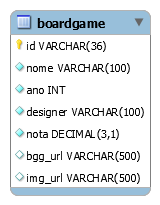

# 🎲 boardgames-mysql

`Boardgames` - banco de dados de exemplo em MySQL.

Contém um cadastro com alguns poucos _boardgames_ e minhas notas pessoais.

## Como carregar

Usando o MySQL Workbench, selecione _File_, _Run Script SQL..._.

Selecione o arquivo contido em [`scripts/boardgames.sql`](scripts/boardgames.sql).

Selecione o conjunto de caracteres `utf8` e execute clicando em _Run_.

_Se preferir, você pode usar outro cliente, como o DBeaver, por exemplo._

## Modelo de dados

Arquivo do MySQL Workbench: [`model/boardgames.mwb`](model/boardgames.mwb)

**Diagrama Entidade-Relacionamento**

